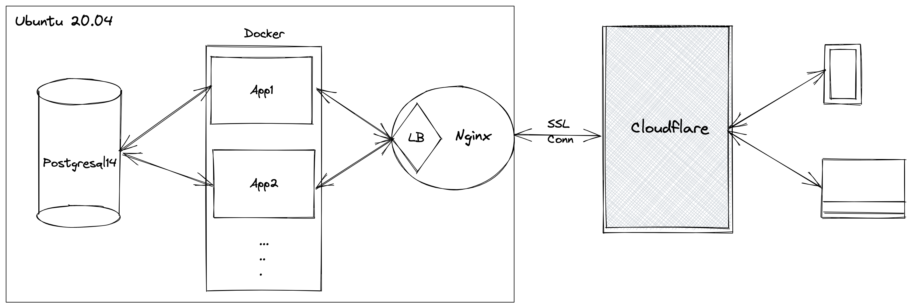

# Hacker's Work BE Service

Site: https://hackerswork.com



## Used libraries
* spring-boot-starter-web
* spring-boot-starter-data-jpa
* spring-boot-starter-validation
* spring-boot-starter-security
* spring-boot-starter-cache
* spring-boot-starter-test
* springfox-swagger-ui
* mapstruct
* h2
* Lombok
* rest-assured
* shedlock
* postgresql

## Follow the below steps to containerize the application

```shell
# Build the project
$ mvn clean package

# Build Docker image
$ docker build --tag=hsw:latest -f Dockerfile .
$ docker build --tag=nginx-hsw:latest -f Dockerfile-web .

# Run App, DB, HttpServer on Docker
$ docker-compose up -d
```

or


```shell
# Build the project
$ mvn clean package

# Build Docker image
$ docker build --tag=hsw:latest -f Dockerfile .
$ docker build --tag=nginx-hsw:latest -f Dockerfile-web .

# Run App, DB, HttpServer on Kubernetes
$ kubectl create -f kube-postgres.yaml
$ kubectl create -f kube-hsw.yaml
$ kubectl create -f kube-nginx.yaml
```

## Screenshots


